> 💡 ✅POPstationにはモードと呼ばれる機能があります。この機能は、特定の用途に特化した回答を生成する機能となっています。POPstationでは、このモードを利用してAIと会話を行います。
> 💡 目次

### モードの利用

モード機能を利用する基本的な手順は以下の通りです。

1. メイン画面から左側にある「モード選択」欄より、実行したいモードをクリックします。

1. 出力条件シートというフォームが表示されます。この画面で、プロンプト（AIへの指示）の入力や、必要に応じてAIモデルの選択、データ参照先の指定、ファイルの添付などを行います。

1. 出力条件シートの条件入力欄に必要事項を入力し、ページ下部にある「実行」ボタンをクリックします。

1. AIより回答が表示されます。追加質問がしたい場合や、回答の手直しを依頼したい場合は、画面下部にあるメッセージボックスから入力を行ってください。
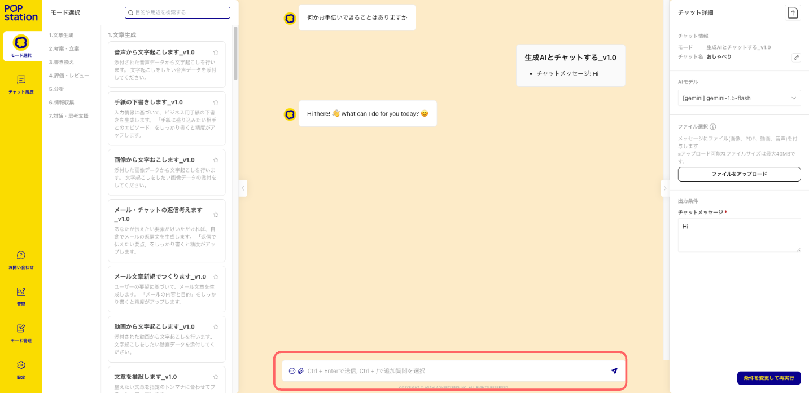

### モードお気に入り機能

よく使うモードをモード選択画面上部に固定することができます。

1. お気に入りに設定したいモードの右にあるお気に入りボタン★をクリックします。
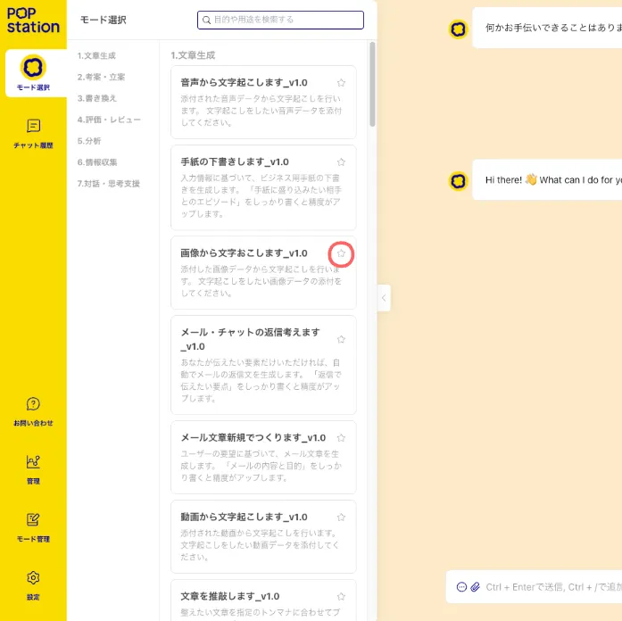
1. モード選択画面上部に「お気に入り」カテゴリが作成され、設定したモードが表示されます。

### モード検索

1. メイン画面のモード選択状態で、画面左上にある検索ボックスをクリックしてください。
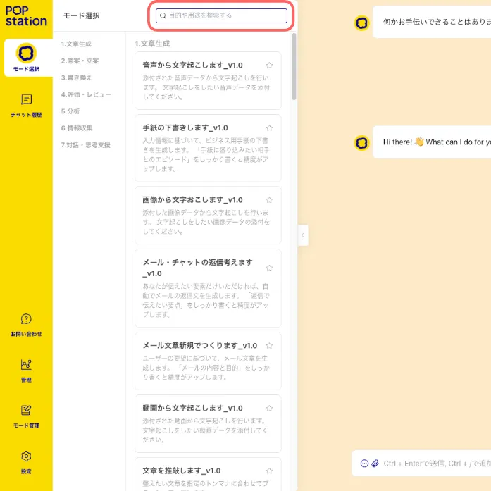
1. 使用したいモードのキーワードを入力すると、検索結果が表示されます。

1. 対応するモードが見つからなかった場合、「検索結果が見つかりませんでした。入力を確認するか、別のキーワードで検索してください」と表示されます。
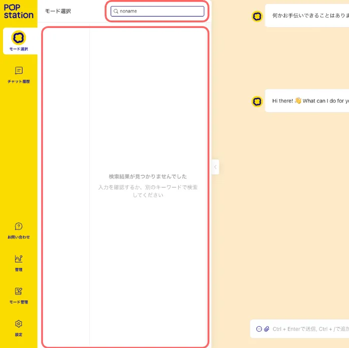

### AIモデルの変更

AIモデルを変更してモードを実行することができます。

* 出力条件シート「AIモデル」ドロップダウンから、モード実行に使用するAIモデルを変更することができます。

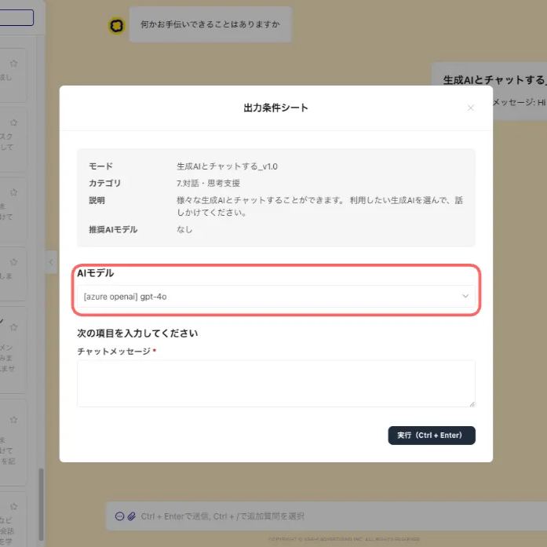

### ファイル入力機能（マルチモーダル機能）

マルチモーダルとは、異なる種類のデータ（テキスト、画像、音声など）を同時に扱うAI技術です。

マルチモーダルに対応しているAIモデル*では、画像・PDF・動画・音声データ・テキストファイルの入力**ができます。

アップロード可能なファイル数は1つのチャットで最大10個までです。

* 現在、gemini-2.0-flash, gemini-1.5-pro, gemini-1.5-flash のみ対応

**対応しているファイル形式は下記の通り

> 💡 　画像：jpg, jpeg, png
　文書：pdf (30MBまで), txt (UTF-8)
　音声：mp3, wav (最大約8.5時間)
　動画：mov, mp4, avi, wmv, mpeg, mpg, flv  (最大約45分)

データを添付する方法は「ファイルのアップロード」と「クリップボードからの貼り付け」の2種類あります。

#### 1. 「ファイルのアップロード」の場合

1. 「ファイルをアップロード」タブをクリックしてください。
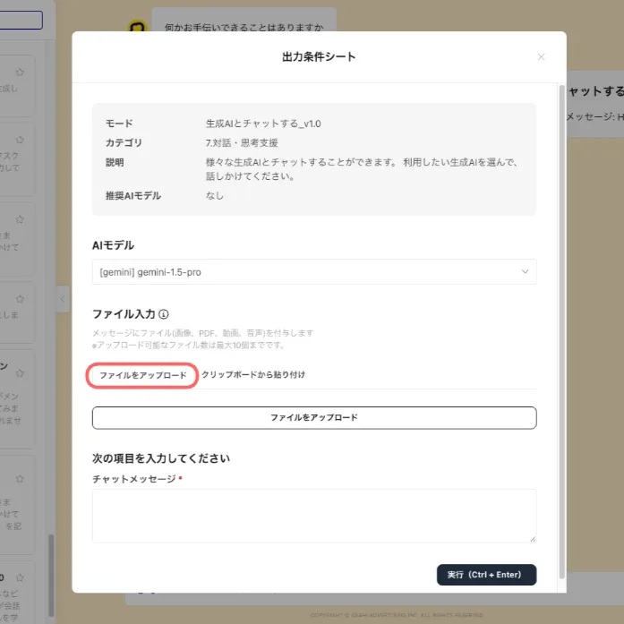
1. 「ファイルをアップロード」ボタンをクリックして、ファイルをアップロードしてください。

1. モードの条件を入力して、「実行」ボタンをクリックしてください。

1. ファイルの内容を踏まえた回答が生成されます。

#### 2. 「クリップボードからの貼付け」の場合（画像のみ）

1. 「クリップボードからの貼付け」タブをクリックしてください。

1. 「ここをクリックしてから画像を貼り付け」部分をクリックして、Ctrl+Vでクリップボードの画像を貼り付けてください。
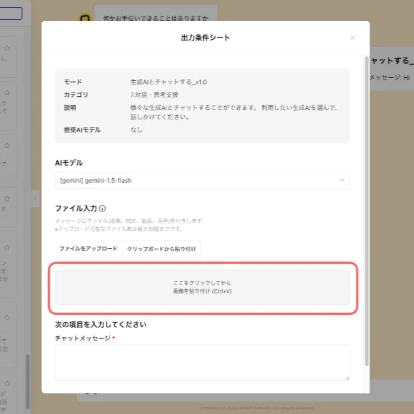
1. モードの条件を入力して、「実行」ボタンをクリックしてください。

1. 画像の内容を踏まえた回答が生成されます。
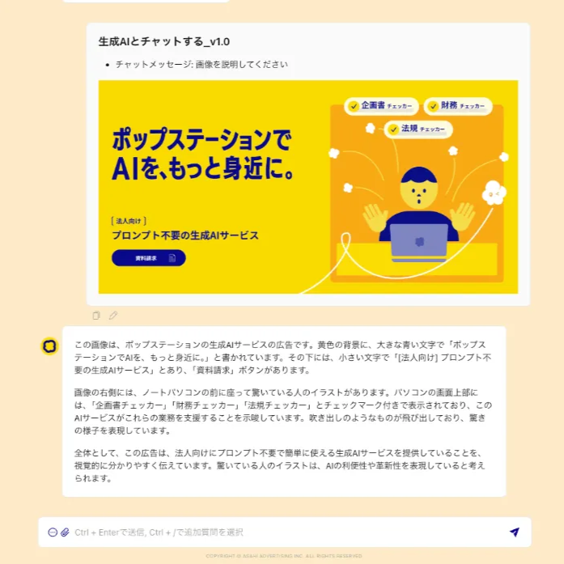

### Web検索機能

Web検索に対応しているモードでは、POPstationからWebページの検索を実行してその検索結果から回答を生成することができます。

1. Web検索に対応しているモードは、モード管理画面より「Web検索機能」の記載があります。

1. 検索対象のワードが含まれるようにモードの条件を入力します。
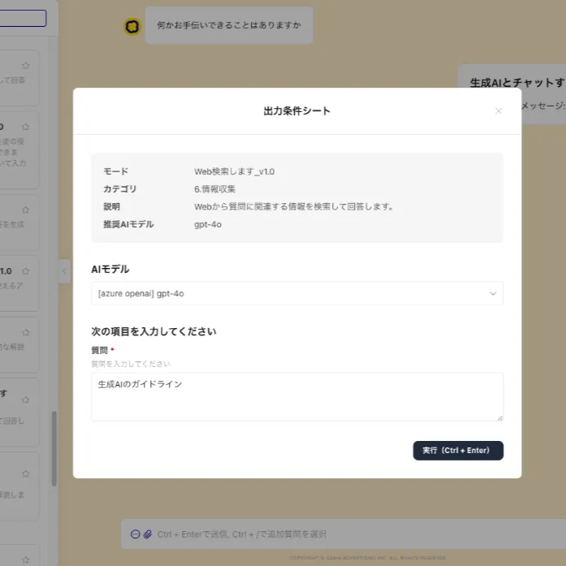
1. Web上から検索したページをもとに回答を生成します。

### URL読込機能

URL読込に対応しているモードでは、入力したURLのページから回答を生成することができます。

1. URL読込に対応しているモードは、モード管理画面より「URL読込」の記載があります
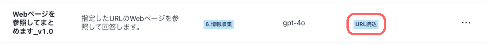
1. URLを指定してモードの条件を入力します。※URL数は5つ以下の指定を推奨しています
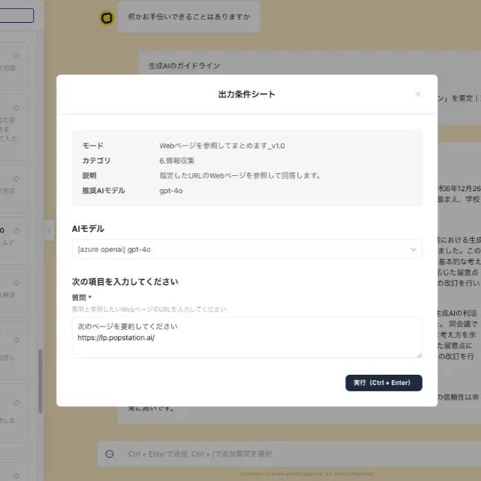
1. 指定したURLのページをもとに回答を生成します。
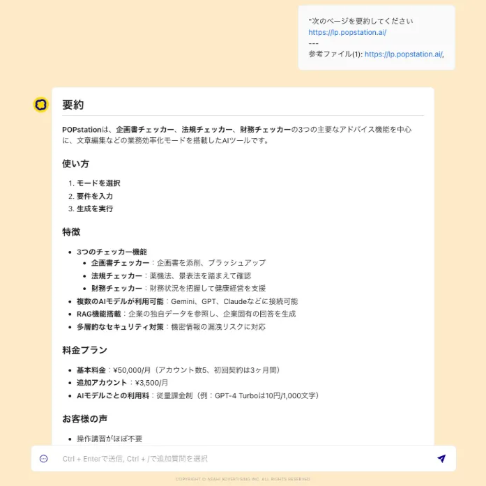

